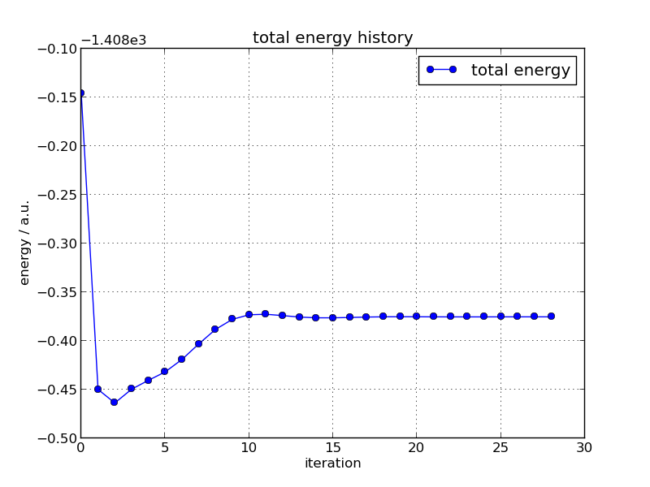

.. -*- coding: utf-8; -*-

*********************************************
Analysis of the ProteinDF Calculation Results
*********************************************

General analysis tools
============================

* pdf-component

Displays atomic orbitals with a large contribution to the specified molecular orbital.

.. code-block:: none

   Usage: pdf-component [Option]

Executing the command above obtains the following outputs:

.. code-block:: none

   $ pdf-component 115
   MO level: 115
   No. 1     8  C (  42.525,   37.241,   32.674) p(    px) (  8.18%;   8.18%)
   No. 2     8  C (  42.525,   37.241,   32.674) p(    pz) (  7.77%;  15.95%)
   No. 3    20  C (  43.858,   35.420,   31.228) p(    px) (  7.38%;  23.34%)
   No. 4    11  N (  41.507,   35.639,   33.859) p(    px) (  6.74%;  30.08%)
   No. 5    14  C (  42.553,   33.543,   32.877) p(    px) (  6.69%;  36.77%)
   No. 6    20  C (  43.858,   35.420,   31.228) p(    pz) (  5.54%;  42.31%)
   No. 7    14  C (  42.553,   33.543,   32.877) p(    pz) (  5.20%;  47.51%)
   No. 8    11  N (  41.507,   35.639,   33.859) p(    pz) (  4.71%;  52.23%)
   No. 9     9  C (  41.623,   36.994,   33.649) p(    px) (  4.39%;  56.62%)
   No.10     9  C (  41.623,   36.994,   33.649) p(    pz) (  3.39%;  60.00%)

* pdf-kwd

Show ProteinDF input keywords.
It can be output in several formats. Please refer to the help(-h).

.. code-block:: none

  Usage: pdf-kwd

* pdf-pop-mulliken

Output Mulliken population.

.. code-block:: none

  Usage: pdf-pop-mulliken <MO_ID>

* pdf-mkfld-mo

Outputs molecular orbital volume data.
It can be output in several formats. Please refer to the help(-h).

.. code-block:: none

   Usage: pdf-mkfld-mo <MO_ID>

* pdf-mkfld-esp

Outputs electrostatic potential volume data.
It can be output in several formats. Please refer to the help(-h).

.. code-block:: none

   Usage: pdf-mkfld-esp

* pdf-mkfld-dens

Outputs electron density volume data.
It can be output in several formats. Please refer to the help(-h).

.. code-block:: none

   Usage: pdf-mkfld-dens

* pdf-archive

Aggregates calculation results to create archives.

.. code-block:: none

   Usage: pdf-archive

* pdf-report

Creates calculation result reports.

.. code-block:: none

   Usage: pdf-archive

The user can obtain energy convergence curve (:num:`Fig. #analysisconvhist`)
and orbital energy convergence history (:num:`Fig. #analysislevelhist`),
as shown below:

.. _analysisconvhist:

   Energy convergence curve

.. _analysislevelhist:

.. figure:: figure/analysis_level_hist.png
   :width: 8cm
   :alt: analysis_level_hist.png
   :align: center

   Orbital energy convergence history

Advanced (debug) tools
========================

* pdf-mat-show

Outputs the specified matrix file (binary format) to standard output.

.. code-block:: none

   Usage: pdf-mat-show <matrix file>

* pdf-vtr-show

Outputs the specified vector file (binary format) to standard output.

.. code-block:: none

   Usage: pdf-vtr-show

* mpac2yml.py

Converts MessagePack files to YAML files.

.. code-block:: none

   Usage: mpac2yml.py [options] FILE

   Options:
   -h, --help  show this help message and exit

* yml2mpac.py

Converts YAML files to MessagePack files.

.. code-block:: none

   Usage: yml2mpac.py [options] YAML_FILE MPAC_FILE

   Options:
   -h, --help  show this help message and exit

* pdf-diff

Compares two calculation results.

.. code-block:: none

   Usage: pdf-diff

* pdf-mat-info

Outputs matrix information.

.. code-block:: none

   Usage: pdf-mat-info

