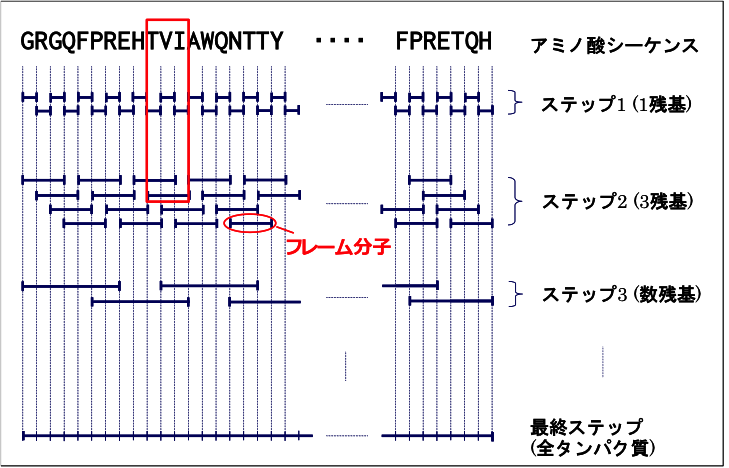

.. -*- coding: utf-8; -*-

***************************
全自動計算プログラムQCLO
***************************

はじめに
========

密度汎関数法による超大規模タンパク質全電子計算は、
密度汎関数法による分子軌道法に基づく計算プログラムProteinDF と、
ProteinDF の実行のための初期値を作成する半自動計算法プログラムQCLO (Quasi-Canonical Localized Orbital)
またはRMO (Regional Molecular Orbital)から構成されます。
QCLOまたはRMOプログラムを実行すると、計算シナリオに従い、
ProteinDF プログラムに計算のための初期値が渡され、ProteinDF プログラムによる全電子計算が実行されます。

.. warning::

  (現在の)QCLOプログラムは今後更新されません。
  新しく開発される全自動計算プログラムと記載が異なる場合があります。

半自動計算法プログラム QCLO
---------------------------

タンパク質全電子自動計算法プログラムは、
QCLO法またはRMO法を用いた収束過程支援のプログラムです。
アミノ酸残基などの単位で局在化していますが、
その中ではアミノ酸残基単体の軌道であるカノニカル軌道に近いQCLOやRMOを切り貼りすると、
ペプチド鎖の分子軌道計算のよい初期値になります。
ペプチド鎖の分子軌道計算結果から再度QCLOやRMOを求め、
さらに大きなペプチド鎖の計算の初期値とし、
これらのペプチド延長過程を繰り返して全電子計算を行う手法をタンパク質の全電子自動計算収束過程法と呼びます。
これにより容易に機能性に富んだタンパク質の精密な量子化学計算を実行できるようになります。

タンパク質全電子計算の収束過程
------------------------------

一般に、タンパク質やペプチド鎖のような大きな分子の電子状態は、
はじめから一点計算を行うことが困難です。
タンパク質をアミノ酸残基のような小さな分子片に分割して、
それらの計算で求められた解を基に徐々に大きなペプチド鎖を計算していくといった手法を用います。
本手法の概要を :num:`Fig. #qclosteps` に示します。

.. _qclosteps:

   タンパク質全電子計算収束過程の概要

ステップ1 ではタンパク質やペプチド鎖をアミノ酸残基1 残基ずつに分割し、これらの計算を行います。
ステップ2 ではステップ1 で計算された1 残基の結果をもとに、3 残基ずつの計算を実行します。
このようにステップ2 以降では重なりを持って切り出します。
同様にステップ3 ではステップ2 の3 残基の結果をもとに数残基のペプチド鎖の計算を実行します。
このとき、ペプチド鎖の両端は対応する2 残基、間は真ん中の1 残基の結果をつなげて、初期値を作成します。
このような操作を繰り返すことにより、次第にペプチド鎖の長さを延長して、
最終的に全タンパク質の計算を実行します。
この収束過程で作成される分子をフレーム分子とよびます。
なお、ステップ1ではHarrisの初期値、ステップ2ではステップ1で計算された電子密度を合成して初期値を作ります。
しかし、つなげる分子の数が多いほど誤差が蓄積しますし、
重なりを持たせているとはいえ、結合部分では比較的大きな誤差が生じます。
このような誤差は大きな分子の分子軌道計算には致命的な欠陥を生じることがあります。
そこで、ステップ3 以降では、新しい局在化軌道をベースにした初期値合成方法を使用します。

カノニカル軌道と局在化軌道
--------------------------

分子軌道の表現には自由度があり、ユニタリ変換によって色々なものに変形できます。
この性質を利用して、次の2 つの表現方法がよく使用されます。
一つは正準直交系であるカノニカル軌道（Canonical Orbital）であり、
もう一つは局在化軌道（Localized Orbital）です。
局在化軌道はそれが空間的に最も狭い範囲で最大限に局在するように決めて求められる軌道です。
その判定は、Edmiston-Rüdenberg、 Foster-Boys らにより提案された局在化指標の式が有名ですが、
Pipek-Mezey のPopulation 法や、GuらのRMO法と呼ばれる方法もあります。
いずれも軌道が特定の空間に局在化すればするほど指標が大きくなるよう立式されています。
特にEdmiston-Rüdenberg、Population 法、およびRMO法の指標によって求められる局在化軌道は、
一般に内殻電子は原子核のまわりに、結合に関与している価電子はその結合の周囲に、
結合に関与していない価電子は、いわゆる孤立電子対軌道の形に局在化するため、
化学者の直感との対応がつきやすいことで知られています。

本システムでは、Edmiston-Rüdenberg法よりも高速な、Population 法とRMO法を採用しました。
ペプチド鎖の良い初期値を合成するために、ステップ3 以降では局在化軌道を用います。
分子軌道を局在した形で表現すれば、分子軌道を化学的によい近似で個別に取り扱うことができます。
つまり煩雑な手続きが必要ですが、局在化軌道が作られれば安全かつ自由に分子軌道を分離結合することが可能になります。
これにより精度の良い初期値を作成することができます。
この切り貼りに便利な軌道をその性質から、先に擬カノニカル局在化軌道(QCLO)と名付けました。
RMO法はまったく異なる計算方法ですが、特定の領域に局在化させた軌道を作成する方法で、基本的に取り扱い方は変わりません。
一般に、分子サイズが大きくなるほど、RMO法の方が高速に計算できます。
これらを用いて初期値を作成する方法は :num:`Fig. #qclofragment` に示すように、
ペプチド鎖をアミノ酸残基の側鎖やアミノ酸をつなぐペプチド結合などの部分（これらをフラグメントと呼ぶ）に分割し、
フラグメントのみに広がり、かつフラグメントのカノニカル分子軌道に似た軌道を求め、
これらを組み合わせてペプチド鎖全体の分子軌道計算の初期値とする方法です。
局在化軌道を求めるには、計算目的となる分子の周辺の影響を取り込むため、
またペプチド結合の部分を厳密に表現するために3 残基以上のフレーム分子から出発します。
このフレーム分子においてペプチド鎖の場合のフラグメントは主鎖と側鎖の2 パターンに分類します。
こう分類することで本システムでは自動的にフラグメントに分けることができます。

.. _qclofragment:

.. figure:: figure/QCLO_fragment.png
   :alt: QCLO_fragment.png
   :align: center
   :width: 8cm

   フレーム分子THR-VAL-GLUとフラグメント

QCLOおよびRMO作成の手順は以下の通りです。

* 手順1 : フレーム分子毎の分子軌道計算

フレーム分子の分子軌道計算を実行します。
フレーム分子の構造はペプチド鎖の相当部分と同じものを用い、
切断されたＮ末、C 末にそれぞれH、OH を付加します。ここで得られる軌道はフレーム分子全体に広がったカノニカル軌道です。

* 手順2 : フレーム分子毎の局在化軌道計算

手順1 で得られた分子軌道を個々の化学結合や孤立電子対に局在する分子軌道に変換します。QCLOとRMOではこの計算方法が異なります。

* 手順3 : フラグメント毎の擬カノニカル局在化軌道計算

手順2 で得られた軌道の中から各フラグメントに属す局在化軌道を選び出し、
それらの係数行列を使用してフレーム分子のKohn-Sham 行列（ab initio HF 法ならばFock行列）を
原子軌道ベースから局在化軌道ベースに変換します。
そうして作られたフラグメントのKohn-Sham 行列の固有値方程式を解くことで
フラグメントに局在しつつ、フラグメント全体に広がった軌道が求められます。
以上の手順1～3 でQCLOまたはRMOが得られます。
手順1～3 をすべてのフレーム分子とそのフラグメントで実行し、初期値は手順4 で作成します。

* 手順4 :局在化軌道の結合

手順3 で計算されたQCLOやRMOはフレーム分子毎に計算されています。
まず、手順1 で付加した原子H、OH の軌道成分は本来のペプチド鎖には存在しないため、取り除きます。
すべてのフラグメントのQCLOまたはRMOを組み合わせてペプチド鎖全体の軌道セットを作成します。
この軌道セットは規格直交化されていないため、ここでLöwdinの直交化を実行します。
Löwdin の直交化はもとの軌道をなるべく変えないように規格直交化を達成しますので、
得られた軌道は手順3 の軌道とほとんど変わりません。これによりペプチド鎖全体で規格直交したLCAO 行列が得られます。

手順1～4 の手順を組み合わせた方法を、タンパク質全電子計算の収束過程と呼びます。

QCLO法に基づく自動計算機能
^^^^^^^^^^^^^^^^^^^^^^^^^^

重複計算を排除するQCLO法に基づく自動計算機能です。
ProteinDFプログラムのフラグメント単位のQCLO計算結果を用いて、
ProteinDFプログラムの初期データ（LCAO）を作成する機能を持ちます。

ProteinDF プログラムでは、Roothaan方程式 :math:`FC=SC\epsilon` を解く際に、行列 :math:`X=U*s^{-1/2}` によって、
直交基底に変換して解いています。

1. 原子軌道 (AO) 基底 KS 行列を、直交化基底 KS 行列に変換

.. math::
   
   F'=X^{t}FXC

2. KS 行列に対するレベルシフト  

.. math::
   
   F'=F'+C'(C'*\beta)^{\dagger}

3. KS 行列の対角化し、直交化基底での係数行列を得る

.. math::
   
   F'C'=C'\epsilon'

4. 係数行列を AO 基底に変換

.. math::
   
   C=XC'

QCLO 法の計算方法の概要を以下に示します。

* 第1ステップ：

普通の SCF MO 計算を全アミノ酸に対して行います。初期電子密度は、原子の電子密度から作成します。

* 第2ステップ：

初期電子密度は、第１ステップで得られたモノマーの電子密度を切り貼りする。
局在化軌道（LO）をフラグメントに振り分けた後、フラグメントの QCLO は、次の式によって求められます。
この固有方程式の解が QCLO です。

.. math::
   
   F'=C_{LO}^{t}FC_{LO}
   
   F'C'=C'\epsilon'

| :math:`F` フレーム分子の Fock or Kohn-Sham 行列
| :math:`C_LO` フラグメントに割り振られた LO の係数行列
| :math:`F'` フラグメントの Fock or Kohn-Sham 行列（LO 基底）

* 第3ステップ以降：

第2ステップの QCLO を集めて初期値を作成する。
集められた QCLO は Löwdin変換によって直交化しなければなりませんが、
変換しても元の QCLO からはほとんど変化しません。
直交化された QCLO から、フラグメントに対する初期値が作成される。
フラグメントに対する Fock もしくは Kohn-Sham 行列は、以下の式で求められます。

.. math::
   
   F'=C_{QCLO}^{t}FC_{QCLO}

| :math:`C_{QCLO}` QCLO の係数行列（原子軌道基底）

この解は、前のステップの QCLO で張られた空間における、第3ステップの QCLO です。
QCLO 法の処理フローを :num:`Fig. #qcloflow`  に示します。

.. _qcloflow:

.. figure:: figure/QCLO_flow.png
   :alt: QCLO_flow.png
   :align: center

   QCLO法の処理フロー

実行方法
========

QCLO法プログラムの入力データの準備
----------------------------------

半自動計算法プログラムの入力キーワードは入力ファイルQcStepにおいて指定します。
以下にQcStepファイルの例を示します。

.. code-block:: none
  
  // Qclo input file
  >>>>CONTROL
        step-selection = { 1 2 3 4 }
        filename = 1hrc_amber.nowat.pdb
  >>>>STEP1
        execution = {creation integral guess pdf }
        sequential-frames = {
                18-24|1
        }
  >>>>STEP2
        execution = {creation integral guessrho pdf lo pickup}

        sequential-frames = {
                18-24|3
        }
  >>>>STEP3
        execution = {creation integral guessqclo pdf lo pickup}

        sequential-frames = {
                18-22
                21-24
        }
  >>>>STEP4
        execution = {creation integral guessqclo pdf }
        sequential-frames = {
                18-24
        }
        pdf-keywords = {
		max-iteration = 5
        ｝
  >>>>GLOBAL
        pdf-keywords = {
           scf-acceleration = damping
           scf-acceleration/damping/damping-factor = 0.90
        ｝

QcStepファイルは、" >>>>"で表されるブロック内にキーワードを指定します。
ブロック名は、CONTROL, STEP#, GLOBALです。ただし、#はStep数を表します。
コメントは//で始まり改行コードまでがコメントとなります。

QCLO法プログラムの実行方法
--------------------------

自動計算法プログラムをコマンドラインから実行するには、以下のように行います。

.. code-block:: bash
  
  % $PDF_HOME/bin/QCLO.x

自動計算法プログラムの入力キーワード
====================================

CONTROL ブロック
----------------

CONTROL ブロックでは、自動計算法全体に関するキーワードを指定します。

step-selection
^^^^^^^^^^^^^^

自動計算法のステップ制御のためのキーワードです。
{}内には同一ファイル内に記述されているSTEP#ブロックキーワードの番号（#）が記述できます。

デフォルト値
""""""""""""

 STEPブロックで指定されたSTEP数

とりうる値
""""""""""

	{ （計算するステップ数）}

使用例
""""""

.. code-block:: none
  
  step-selection = { 1 2 3 4 }

filename
^^^^^^^^

PDBファイルまたはPDBファイルフォーマットに従ったファイルをサポートします。

デフォルト値
""""""""""""

なし

とりうる値
""""""""""

PDBファイル名またはPDBファイルフォーマットに従ったファイル名

使用例
""""""

.. code-block:: none
  
  filename = 1hrc_amber.nowat.pdb

STEP ブロック
-------------

STEP ブロックでは、各計算STEPに関するキーワードを指定します。

sequential-frames
^^^^^^^^^^^^^^^^^

ペプチド鎖フレームを指定するキーワード。
sequential-frames ={  }の形式でペプチド鎖フレームを指定します。
{}内でペプチド鎖のフレーム定義とその一連の計算を指示します。
{}内の記述の仕方は以下のとおりです。

* $1-$2|$3

$1～$2残基ペプチド鎖を$3残基毎に2残基の重なりを持って切り分けた断片を定義します。
最終断片は$3残基でなくてもかまいません。

* $4

$4残基番号のアミノ酸残基

* $5-$6

$5～$6残基ペプチド鎖($1-$2|$3の$3省略時に相当する。)

デフォルト値
""""""""""""

なし

とりうる値
""""""""""

ペプチド鎖フレーム構成残基番号

使用例
""""""

.. code-block:: none

  sequential-frames = {
    18-24|3
  }

general-frames
^^^^^^^^^^^^^^

一般のフレーム分子を定義し、その一連の計算を実行するためのキーワードです。
以下の形式で指定します。

.. code-block:: none

  general-frames = {
    name : {
      …	
    }
  }

nameはシステム予約名を除く任意の文字列を指定できます。
{}内にはSTEP#以前に計算済みのsequential-framesキーワード右値{}内文字列を記述することができます。

デフォルト値
""""""""""""

なし

使用例
""""""

.. code-block:: none

  general-frames = {
    H2O : {
               {
               }
          }
    }

execution
^^^^^^^^^

STEP# 内の実行制御のためのキーワードです。
{}内には以下の文字列が記述できます。

- creation

作業環境作成

* integral

ProteinDFの積分実行

* guess

ProteinDFによるinitial guess作成

* guessrho

ρ~結合によるinitial guess作成

* guessdensity

密度行列の結合によるinitial guess作成

* guessqclo

QCLOによるinitial guess作成。(STEP 3以降有効)

* guessfile

qclo-keywordsで指定した初期データファイルを使用

* pdf

ProteinDF計算

* lo

軌道局在化計算

* pickup

局在化軌道のフラグメントへの振り分け

* pdfqclo

拡張QCLO法による分子軌道計算

デフォルト値
""""""""""""

Step1では execution = {creation integral guess pdf }

Step2では execution = {creation integral guessrho pdf lo pickup }

Step3以降は execution = {	creation integral guessqclo pdf lo pickup }

とりうる値
""""""""""

 creation,integral, guess, guessrho, guessqclo, guessfile,  lo, pickup, pdf, pdfqclo

使用例
""""""

.. code-block:: none
  
  execution = { creation integral guess pdf }
  execution = { creation integral guessrho pdf lo pickup }
  execution = { creation integral guessqclo pdf lo pickup }

上記の例はSTEP1, STEP2, STEP#(#>2)のデフォルト値を示しています。

GLOBAL ブロック
---------------

このブロック内に記述されたキーワードは全てのブロックに反映します。
現行では以下に示す ``pdf-keywords`` と ``qclo-keywords`` が記述できます。

その他のキーワード
------------------

pdf-keywords
^^^^^^^^^^^^

これを記述したブロック内でのProteinDF計算においてのみ有効となる
ProteinDFプログラムの入力キーワードを指定します。
以下の形式で指定します。

.. code-block:: none

  pdf-keywords = {
    ProteinDFプログラムの入力キーワード群
  }

これらは自動計算法入力ファイルのどこに記述してもかまいません。
このときキーワードの優先順位と有効範囲は以下とします。

.. code-block:: none

  {}内 > {}外 > STEP#ブロック > GLOBALブロック > CONTROLブロック

デフォルト値
""""""""""""

なし

とりうる値
""""""""""

ProteinDFプログラムの入力キーワード

使用例
""""""

.. code-block:: none

  pdf-keywords = {
    max-iteration = 5
  }

qclo-keywords
^^^^^^^^^^^^^

これを記述したブロック内での自動計算においてのみ有効となる自動計算法プログラムの入力キーワードを指定します。

.. code-block:: none

  qclo-keywords = {
    自動計算法プログラムの入力キーワード群
  }

これらは自動計算法入力ファイルのどこに記述してもかまいません。
このときキーワードの優先順位と有効範囲は以下の通りです。

.. code-block:: none

  {}内 > {}外 > STEP#ブロック > GLOBALブロック > CONTROLブロック

デフォルト値
""""""""""""

なし

とりうる値
""""""""""

自動計算法プログラムの入力キーワード

使用例
""""""

.. code-block:: none

  qclo-keywords = {
    set_fragment_by_element
  }

fragment
^^^^^^^^

フレーム分子のQCLO作成時のフラグメント分割を、以下の形式で指定します。

.. code-block:: none

  fragment = {
    フラグメント１の名前 = {
      フラグメント１の構成要素１
        ...
      フラグメント１の構成要素ｍ
    }
    ...
    フラグメントｎの名前 = {
    ...
    }
  }

以上の指定は、フレーム分子の定義箇所の中に記述します。

デフォルト値
""""""""""""

なし

使用例
""""""

.. code-block:: none

  fragment = {
    frag_res18 = {
      18
    }
    frag_res19_21 = {
      19-21
    }
    frag_res22 = {
      22
    }
  ｝

qclo-keywordsで指定する計算条件
-------------------------------

add_ethyl
^^^^^^^^^

フレーム分子にエチル基を付加します。
エチル基の座標データには、指定したアミノ酸残基の側鎖の座標データを用います。

デフォルト値
""""""""""""

なし

とりうる値
""""""""""

残基番号

使用例
""""""

.. code-block:: none

  add_ethyl  =  18

set_fragment_add_ethyl
^^^^^^^^^^^^^^^^^^^^^^

フレーム分子を、指定したアミノ酸残基の一部とみなし、側鎖に相当する部分を切り出してRsideフラグメントを作成します。

デフォルト値
""""""""""""

なし

とりうる値
""""""""""

残基番号

使用例
""""""

.. code-block:: none

  set_fragment_add_ethyl  =  18

no_add_terminal
^^^^^^^^^^^^^^^

ペプチド結合を切断した箇所に H, OH を付加する処理を行わないようにします。

デフォルト値
""""""""""""

なし

とりうる値
""""""""""

なし

使用例
""""""

.. code-block:: none

  no_add_terminal

set_fragment_by_element
^^^^^^^^^^^^^^^^^^^^^^^

QCLO作成時のフラグメント分割を、初期値作成時のフラグメント分割と同一にします。

デフォルト値
""""""""""""
なし

とりうる値
""""""""""
なし

使用例
""""""

.. code-block:: none

  set_fragment_by_element

localize_unocc_orbital
^^^^^^^^^^^^^^^^^^^^^^

QCLO作成時に空軌道もLocalize処理を行います。

デフォルト値
""""""""""""

なし

とりうる値
""""""""""

なし

使用例
""""""

.. code-block:: none

  localize_unocc_orbital

pickup_unocc_orbital
^^^^^^^^^^^^^^^^^^^^

空軌道についてLOのフラグメントへの割り当て処理を行います。

デフォルト値
""""""""""""

なし

とりうる値
""""""""""

なし

使用例
""""""

.. code-block:: none
  
  pickup_unocc_orbital

guessqclo_combine_unocc_orbital
^^^^^^^^^^^^^^^^^^^^^^^^^^^^^^^

QCLOからの初期値作成時に空軌道についても処理を行います。

デフォルト値
""""""""""""

なし

とりうる値
""""""""""

なし

使用例
""""""

.. code-block:: none

  guessqclo_combine_unocc_orbita

initial-guess-lcao-file
^^^^^^^^^^^^^^^^^^^^^^^

RKS計算において、LCAO展開係数行列の初期データファイルを指定します。

デフォルト値
""""""""""""
なし

とりうる値
""""""""""
ファイル名

使用例
""""""

.. code-block:: none
  
  initial-guess-lcao-file  =  step3/13_19/result.guess.lcao.rks

initial-guess-lcao-alpha-file
^^^^^^^^^^^^^^^^^^^^^^^^^^^^^

UKS計算において、α電子軌道のLCAO展開係数行列の初期データファイルを指定します。

デフォルト値
""""""""""""
なし

とりうる値
""""""""""

ファイル名

使用例
""""""

.. code-block:: none
  
  initial-guess-lcao-alpha-file  =  step3/13_19/result.guess.lcao.uks-alpha

initial-guess-lcao-beta-file
^^^^^^^^^^^^^^^^^^^^^^^^^^^^

UKS計算において、β電子軌道のLCAO展開係数行列の初期データファイルを指定します。

デフォルト値
""""""""""""

なし

とりうる値
""""""""""

ファイル名

使用例
""""""

.. code-block:: none
  
  initial-guess-lcao-beta-file  =  step3/13_19/result.guess.lcao.uks-beta

initial-guess-occ-file
^^^^^^^^^^^^^^^^^^^^^^

RKS計算において、占有数の初期データファイルを指定します。

デフォルト値
""""""""""""

なし

とりうる値
""""""""""

ファイル名

使用例
""""""

.. code-block:: none
  
  initial-guess-occ-file  =  step3/13_19/result.guess.occ.rks

initial-guess-occ-alpha-file
^^^^^^^^^^^^^^^^^^^^^^^^^^^^

UKS計算において、α電子占有数の初期データファイルを指定します。

デフォルト値
""""""""""""
なし

とりうる値
""""""""""

ファイル名

使用例
""""""

.. code-block:: none
  
  initial-guess-occ-alpha-file  =  step3/13_19/result.guess.occ.uks-alpha

initial-guess-occ-beta-file
^^^^^^^^^^^^^^^^^^^^^^^^^^^

UKS計算において、β電子占有数の初期データファイルを指定します。

デフォルト値
""""""""""""

なし

とりうる値
""""""""""

ファイル名

使用例
""""""

.. code-block:: none
  
  initial-guess-occ-beta-file  =  step3/13_19/result.guess.occ.uks-beta

initial-guess-rho-file
^^^^^^^^^^^^^^^^^^^^^^

近似電子密度展開係数の初期データファイルを指定します。

デフォルト値
""""""""""""

なし

とりうる値
""""""""""

ファイル名

使用例
""""""

.. code-block:: none
  
  initial-guess-rho-file  =  guess2.ch3ch2coox.txt

initial-qclo-file
^^^^^^^^^^^^^^^^^

フラグメントのQCLOの初期データファイルを、フラグメント名、ファイル名の順に指定します。

デフォルト値
""""""""""""

なし

使用例
""""""

.. code-block:: none
  
  initial-qclo-file = fragment1  step3/13_19/fl_Work/fl_Mtr_C.matrix.frag1.rks8

